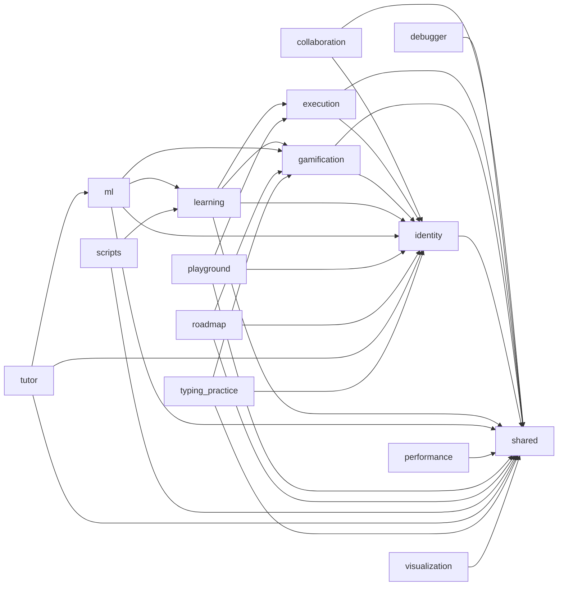

# 컴포넌트 다이어그램 (역추출)

소스: `backend\src\code_tutor` 하위 패키지 간 임포트 의존.

## Evidence (fabrication-floor)

- `collaboration → identity` — backend/src/code_tutor/collaboration/interface/http_routes.py:17
- `collaboration → shared` — backend/src/code_tutor/collaboration/application/services.py:32
- `debugger → shared` — backend/src/code_tutor/debugger/interface/routes.py:9
- `execution → identity` — backend/src/code_tutor/execution/interface/routes.py:10
- `execution → shared` — backend/src/code_tutor/execution/application/services.py:7
- `gamification → identity` — backend/src/code_tutor/gamification/infrastructure/repository.py:310
- `gamification → shared` — backend/src/code_tutor/gamification/infrastructure/models.py:27
- `identity → shared` — backend/src/code_tutor/identity/application/services.py:20
- `learning → execution` — backend/src/code_tutor/learning/application/submission_evaluator.py:12
- `learning → gamification` — backend/src/code_tutor/learning/interface/routes.py:10
- `learning → identity` — backend/src/code_tutor/learning/interface/routes.py:16
- `learning → shared` — backend/src/code_tutor/learning/application/dashboard_service.py:27
- `ml → gamification` — backend/src/code_tutor/ml/interface/routes.py:18
- `ml → identity` — backend/src/code_tutor/ml/interface/routes.py:20
- `ml → learning` — backend/src/code_tutor/ml/analysis/quality_recommender.py:12
- `ml → shared` — backend/src/code_tutor/ml/analysis/quality_recommender.py:14
- `performance → shared` — backend/src/code_tutor/performance/interface/routes.py:5
- `playground → execution` — backend/src/code_tutor/playground/application/services.py:6
- `playground → identity` — backend/src/code_tutor/playground/interface/routes.py:8
- `playground → shared` — backend/src/code_tutor/playground/application/services.py:40
- `roadmap → gamification` — backend/src/code_tutor/roadmap/interface/routes.py:9
- `roadmap → identity` — backend/src/code_tutor/roadmap/interface/routes.py:15
- `roadmap → shared` — backend/src/code_tutor/roadmap/domain/entities.py:11
- `scripts → learning` — backend/src/code_tutor/scripts/seed_problems.py:8
- `scripts → shared` — backend/src/code_tutor/scripts/seed_problems.py:12
- `tutor → identity` — backend/src/code_tutor/tutor/interface/routes.py:10
- `tutor → ml` — backend/src/code_tutor/tutor/infrastructure/llm_service.py:607
- `tutor → shared` — backend/src/code_tutor/tutor/application/services.py:6
- `typing_practice → gamification` — backend/src/code_tutor/typing_practice/interface/routes.py:9
- `typing_practice → identity` — backend/src/code_tutor/typing_practice/interface/routes.py:15
- `typing_practice → shared` — backend/src/code_tutor/typing_practice/infrastructure/models.py:19
- `visualization → shared` — backend/src/code_tutor/visualization/interface/routes.py:5

<!-- entries=32 spans=32 -->
